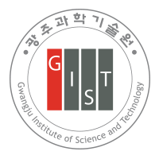
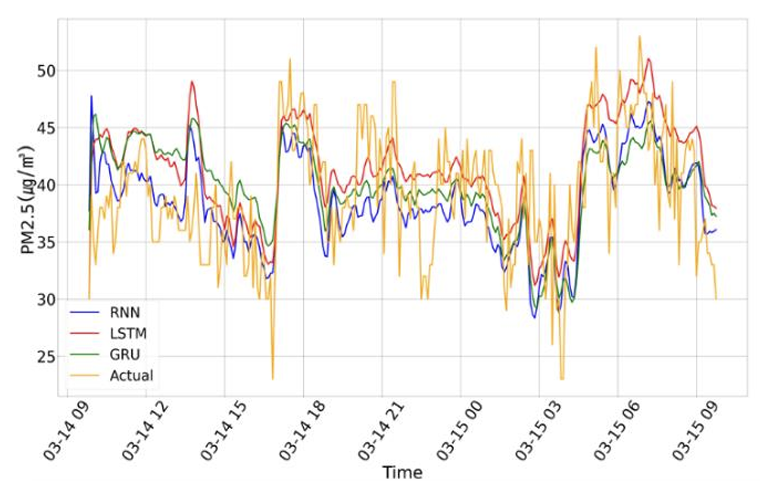
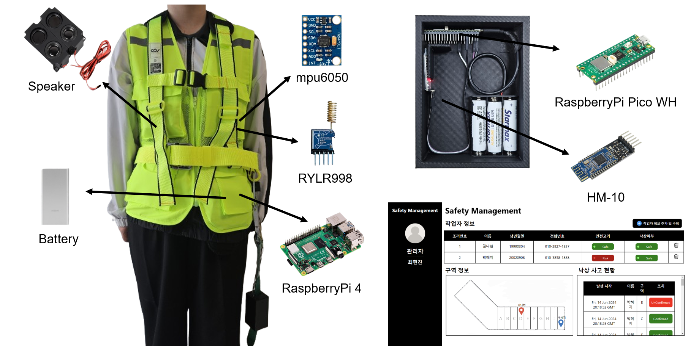
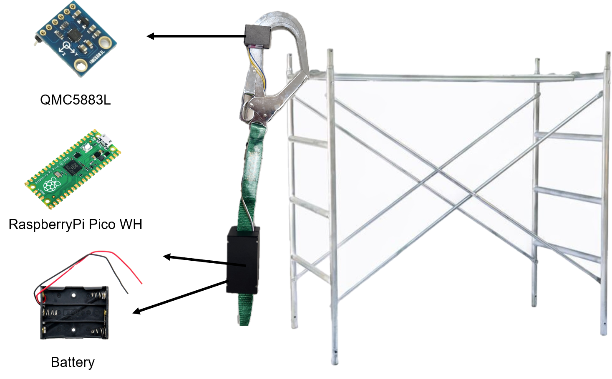

<h1>About Me</h1>

  Hello!

  I'm Hyunjin Choi, a master’s student at the Human-Centered Intelligent Systems (HCIS) Lab at <em>Gwangju Institute of Science and Technology (GIST)</em>.

  My research interests are in <strong>HCI(Human-Computer Interaction)</strong>, particularly in the areas of multisensory feedback, AI-driven interaction, XR, embodiment, and haptics. I aim to explore how these technologies can support more intuitive and expressive user experiences.

  You can reach me at <a href="mailto:zn98520@gmail.com">zn98520@gmail.com</a>,  
  or view my <a href="./assets/files/CV-HyunjinChoi.pdf" target="_blank">CV here</a> for more details.

<h1>Education</h1>

  

    <h3 style="margin: 0;">
      
      <strong>Gwangju Institute of Science and Technology (GIST)</strong>
    </h3>
    
<em>Master’s student</em> at Human-Centered Intelligent Systems Lab, AI Convergence

    
Sep 2025 — Present

  

  

    <h3 style="margin: 0;">
      
      <strong>Soonchunhyang University (SCH)</strong>
    </h3>
    
<em>Bachelor of Science (B.S.)</em> in Internet of Things

    
Mar 2021 — Feb 2025

    
GPA: 4.4 / 4.5

  

<h1>Selected Publications</h1>

  
  

    <h3><a href="./assets/files/paper1.pdf" target="_blank">
      Particular Matter Estimation at Virtual Station using Air Quality Collection IoT Device
    </a></h3>
    

      <strong>Hyunjin Choi</strong>, Chanyoung Park, Minji An, Hyohoon Kim, Jaeseok Yun 
      <em>Korea Computer Congress (KCC)</em>
    

  

  
  

    <h3><a href="./assets/files/paper2.pdf" target="_blank">
      A LoRa-based IoT Monitoring System for Enhancing the Safety of Construction Site Workers
    </a></h3>
    

      <strong>Hyunjin Choi</strong>, Nahyun Kim, Hyeji Park, Dongmin Kim 
      <em>KICS Summer Conference</em>
    

  

  
  

    <h3><a href="./assets/files/paper3.pdf" target="_blank">
      A Study on Smart Safety Harness using a Magnetic Field Detection Sensor
    </a></h3>
    

      Hyeji Park, Nahyun Kim, <strong>Hyunjin Choi</strong>, Dongmin Kim 
      <em>KICS Summer Conference</em>
    

  

  <a href="/assets/files/CV-HyunjinChoi.pdf" target="_blank">See full list →</a>

